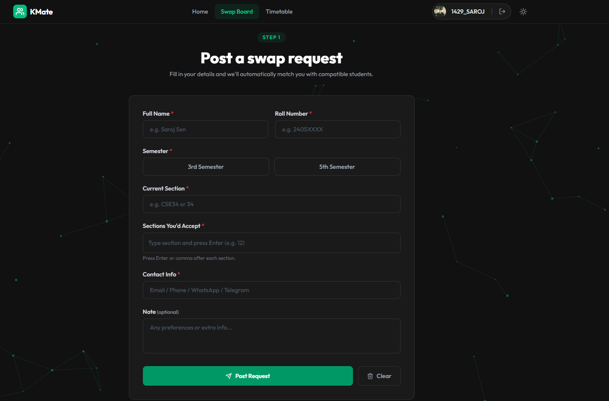
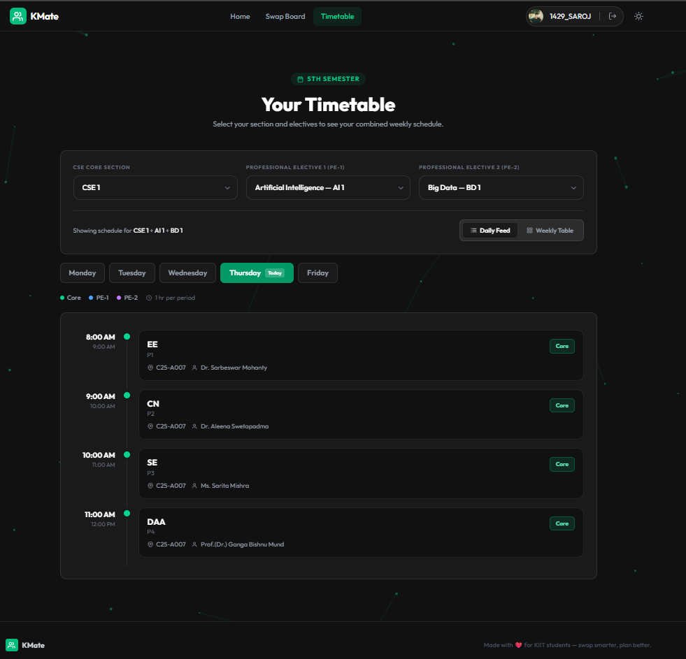

<div align="center">

<<<<<<< HEAD


# KSwapFinder

### Find your perfect section swap at KIIT.

A fast and simple platform that helps students find **mutual section swaps** without scrolling through hundreds of WhatsApp messages.
=======


# KMate

### Your companion for everything KIIT.

A student-built platform that brings together essential KIIT resources in one place. From **Section Swapping** and **Class Timetables** to **Section Group Links**, KMate is designed to make student life easier.
>>>>>>> ad0ec4f (Initial commit)

<p>
    <a href="https://section-swapping-zdyj.vercel.app/">
        
    </a>
<<<<<<< HEAD
    <a href="https://github.com/YOUR_USERNAME/KSwapFinder">
=======
    <a href="https://github.com/sarojsenn/section-swapping">
>>>>>>> ad0ec4f (Initial commit)
        
    </a>
</p>

<p>

<<<<<<< HEAD


=======


>>>>>>> ad0ec4f (Initial commit)


</p>

</div>

---

<<<<<<< HEAD
## About

Every semester during section selection, KIIT students spend hours searching through different WhatsApp groups trying to find someone willing to exchange sections.

**KSwapFinder** makes that process easier.

Simply post your current section, choose the section you want, and the platform instantly finds students who match your request.

The platform currently hosts **150+ active swap requests** and has helped hundreds of students connect during the section swapping period.

---

## Features

- No login or registration required
- Completely free to use
- Post your section swap request
- Browse all active requests
- Instant **Perfect Match** detection
- **Partial Match** suggestions
- Public request board
- Unofficial section WhatsApp group links
- Add missing group links to help other students
- Mobile responsive interface
- Fast and lightweight

---

## How it Works

1. Enter your current section.
2. Choose the section you want.
3. Submit your request.
4. KSwapFinder automatically finds:
   - ✅ Perfect Matches
   - 🔄 Partial Matches
5. Contact the matched student and complete the swap.

---

## Tech Stack

| Category | Technology |
|----------|------------|
=======
# 📖 About

Every semester, KIIT students switch between multiple WhatsApp groups, PDFs, and websites to access important academic resources.

KMate brings these resources together in one place.

The platform initially started as **KSwapFinder**, a website to simplify section swapping. As more students began using it, the vision expanded into building a centralized platform for everyday student needs.

Currently, KMate provides:

- 🔄 Section Swapping
- 📅 Class Timetables
- 👥 Unofficial Section Groups

More features like **Previous Year Questions (PYQs)**, **Notes**, and other academic tools are planned for future releases.

---

# ✨ Features

## 🔄 Section Swapping

- Post section swap requests
- Browse all active requests
- Instant **Perfect Match** detection
- **Partial Match** suggestions
- No login required

---

## 📅 Class Timetables

- View section-wise timetables
- Quick access
- Mobile-friendly interface

---

## 👥 Section Groups

- Browse unofficial section WhatsApp groups
- Add missing group links
- Help other students discover their class groups

---

## 🚀 General

- No registration required
- Completely free
- Responsive UI
- Fast and lightweight
- Built specifically for KIIT students

---

# 💻 Tech Stack

| Category | Technology |
|-----------|------------|
>>>>>>> ad0ec4f (Initial commit)
| Frontend | React.js |
| Styling | Tailwind CSS |
| State Management | React Context API |
| Backend | Supabase |
<<<<<<< HEAD
| Database | PostgreSQL (Supabase) |
=======
| Database | PostgreSQL |
>>>>>>> ad0ec4f (Initial commit)
| Build Tool | Vite |
| Deployment | Vercel |

---

<<<<<<< HEAD
## Project Structure

```text
KSwapFinder
=======
# 📂 Project Structure

```text
KMate
>>>>>>> ad0ec4f (Initial commit)
│
├── public/
│   ├── kiit-images/
│   ├── favicon.svg
│   ├── icons.svg
<<<<<<< HEAD
│   └── kswapfinder-logo.png
=======
│   └── kmate-logo.svg
>>>>>>> ad0ec4f (Initial commit)
│
├── src/
│   ├── assets/
│   ├── components/
│   ├── context/
│   ├── lib/
│   ├── utils/
│   ├── App.jsx
│   ├── index.css
│   └── main.jsx
│
├── .gitignore
├── .oxlintrc.json
├── index.html
├── package.json
├── package-lock.json
├── tailwind.config.js
├── vite.config.js
└── README.md
```

---

<<<<<<< HEAD
## Architecture
=======
# 🏗️ Architecture
>>>>>>> ad0ec4f (Initial commit)

```text
                React Frontend
                      │
                      ▼
<<<<<<< HEAD
          Reusable Components
=======
            Reusable Components
>>>>>>> ad0ec4f (Initial commit)
                      │
                      ▼
             React Context API
                      │
                      ▼
<<<<<<< HEAD
          Supabase Client (lib/)
=======
             Supabase Client
>>>>>>> ad0ec4f (Initial commit)
                      │
                      ▼
        Supabase PostgreSQL Database
```

---

<<<<<<< HEAD
## Installation
=======
# 🚀 Getting Started
>>>>>>> ad0ec4f (Initial commit)

Clone the repository

```bash
<<<<<<< HEAD
git clone https://github.com/YOUR_USERNAME/KSwapFinder.git
=======
git clone https://github.com/sarojsenn/section-swapping.git
>>>>>>> ad0ec4f (Initial commit)
```

Move into the project

```bash
<<<<<<< HEAD
cd KSwapFinder
=======
cd section-swapping
>>>>>>> ad0ec4f (Initial commit)
```

Install dependencies

```bash
npm install
```

Create a `.env` file

```env
VITE_SUPABASE_URL=YOUR_SUPABASE_URL
<<<<<<< HEAD

=======
>>>>>>> ad0ec4f (Initial commit)
VITE_SUPABASE_ANON_KEY=YOUR_SUPABASE_ANON_KEY
```

Run the development server

```bash
npm run dev
```

---

<<<<<<< HEAD
## Screenshots

<h2>Home Page</h2>

<p align="center">
  
</p>

## Future Improvements

- User authentication
- Email notifications
- Advanced search and filters
- In-app messaging
- Admin dashboard
- Analytics dashboard
- Multi-college support
- Better recommendation algorithm

---

## Disclaimer

> **KSwapFinder is only a platform that helps students find mutual section swaps.**

The platform **does not encourage, promote, or support** exchanging money or any other form of payment for section swaps.

Users are responsible for any communication or agreements made outside the platform.

---

## Contributing

Contributions are always welcome.
=======
# 📸 Screenshots

## Home

<p align="center">
    
</p>

## Section Swap

<p align="center">
    
</p>

## Timetable

<p align="center">
    
</p>

## Section Groups

<p align="center">
    
</p>

---

# 🗺️ Roadmap

- ✅ Section Swapping
- ✅ Class Timetables
- ✅ Section Group Links
- 🚧 Previous Year Questions (PYQs)
- 🚧 Notes Repository
- 🚧 Attendance Calculator
- 🚧 CGPA Calculator
- 🚧 Academic Calendar
- 🚧 Faculty Directory
- 🚧 Campus Notices

---

# 🤝 Contributing

Contributions are welcome.
>>>>>>> ad0ec4f (Initial commit)

```bash
# Fork the repository

# Create a new branch
git checkout -b feature-name

# Commit your changes
<<<<<<< HEAD
git commit -m "Added a new feature"

# Push to GitHub
=======
git commit -m "Add new feature"

# Push
>>>>>>> ad0ec4f (Initial commit)
git push origin feature-name
```

Then open a Pull Request.

---

<<<<<<< HEAD
## Author

**Saroj Sen**

GitHub: https://github.com/sarojsenn

LinkedIn: https://www.linkedin.com/in/saroj-sen-227549318/

Live Website: https://section-swapping-zdyj.vercel.app/

---

## Support

If you found this project useful, consider giving it a ⭐ on GitHub.

It helps others discover the project and motivates future improvements.
=======
# ⚠️ Disclaimer

KMate is an **unofficial** platform built by students for students.

For the **Section Swap** feature, KMate only helps students find **mutual section swaps**.

The platform **does not encourage, promote, or support** exchanging money or any other form of payment for section swaps.

KMate is **not affiliated with KIIT University**.

---

# 👨‍💻 Author

**Saroj Sen**

**GitHub:** https://github.com/sarojsenn

**LinkedIn:** https://www.linkedin.com/in/saroj-sen-227549318/

**Live Website:** https://section-swapping-zdyj.vercel.app/

---

# ⭐ Support

If you found KMate useful, consider giving this repository a **Star**.

Your support helps the project reach more KIIT students and motivates future development.

---

<div align="center">

### Built by a KIIT student, for the KIIT community.

</div>
>>>>>>> ad0ec4f (Initial commit)
