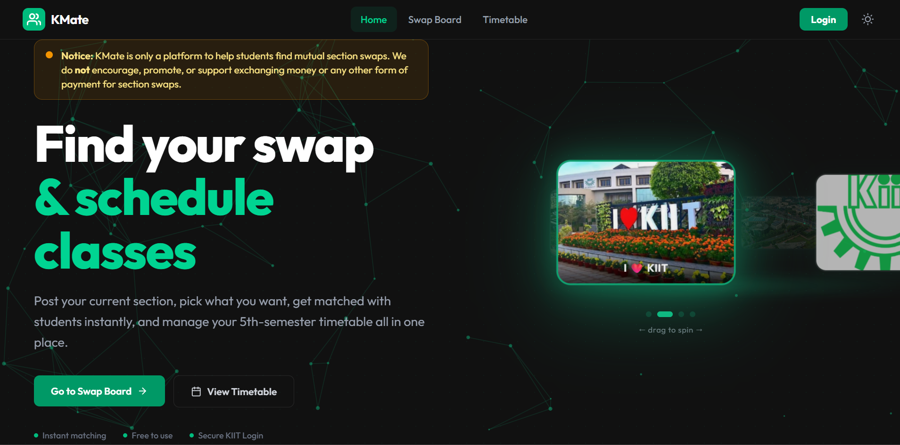

<div align="center">


# KSwapFinder

### Find your perfect section swap at KIIT.

A fast and simple platform that helps students find **mutual section swaps** without scrolling through hundreds of WhatsApp messages.

<p>
    <a href="https://section-swapping-zdyj.vercel.app/">
        
    </a>
    <a href="https://github.com/YOUR_USERNAME/KSwapFinder">
        
    </a>
</p>

<p>


</p>

</div>

---

## About

Every semester during section selection, KIIT students spend hours searching through different WhatsApp groups trying to find someone willing to exchange sections.

**KSwapFinder** makes that process easier.

Simply post your current section, choose the section you want, and the platform instantly finds students who match your request.

The platform currently hosts **150+ active swap requests** and has helped hundreds of students connect during the section swapping period.

---

## Features

- No login or registration required
- Completely free to use
- Post your section swap request
- Browse all active requests
- Instant **Perfect Match** detection
- **Partial Match** suggestions
- Public request board
- Unofficial section WhatsApp group links
- Add missing group links to help other students
- Mobile responsive interface
- Fast and lightweight

---

## How it Works

1. Enter your current section.
2. Choose the section you want.
3. Submit your request.
4. KSwapFinder automatically finds:
   - ✅ Perfect Matches
   - 🔄 Partial Matches
5. Contact the matched student and complete the swap.

---

## Tech Stack

| Category | Technology |
|----------|------------|
| Frontend | React.js |
| Styling | Tailwind CSS |
| State Management | React Context API |
| Backend | Supabase |
| Database | PostgreSQL (Supabase) |
| Build Tool | Vite |
| Deployment | Vercel |

---

## Project Structure

```text
KSwapFinder
│
├── public/
│   ├── kiit-images/
│   ├── favicon.svg
│   ├── icons.svg
│   └── kswapfinder-logo.png
│
├── src/
│   ├── assets/
│   ├── components/
│   ├── context/
│   ├── lib/
│   ├── utils/
│   ├── App.jsx
│   ├── index.css
│   └── main.jsx
│
├── .gitignore
├── .oxlintrc.json
├── index.html
├── package.json
├── package-lock.json
├── tailwind.config.js
├── vite.config.js
└── README.md
```

---

## Architecture

```text
                React Frontend
                      │
                      ▼
          Reusable Components
                      │
                      ▼
             React Context API
                      │
                      ▼
          Supabase Client (lib/)
                      │
                      ▼
        Supabase PostgreSQL Database
```

---

## Installation

Clone the repository

```bash
git clone https://github.com/YOUR_USERNAME/KSwapFinder.git
```

Move into the project

```bash
cd KSwapFinder
```

Install dependencies

```bash
npm install
```

Create a `.env` file

```env
VITE_SUPABASE_URL=YOUR_SUPABASE_URL

VITE_SUPABASE_ANON_KEY=YOUR_SUPABASE_ANON_KEY
```

Run the development server

```bash
npm run dev
```

---

## Screenshots

<h2>Home Page</h2>

<p align="center">
  
</p>

## Future Improvements

- User authentication
- Email notifications
- Advanced search and filters
- In-app messaging
- Admin dashboard
- Analytics dashboard
- Multi-college support
- Better recommendation algorithm

---

## Disclaimer

> **KSwapFinder is only a platform that helps students find mutual section swaps.**

The platform **does not encourage, promote, or support** exchanging money or any other form of payment for section swaps.

Users are responsible for any communication or agreements made outside the platform.

---

## Contributing

Contributions are always welcome.

```bash
# Fork the repository

# Create a new branch
git checkout -b feature-name

# Commit your changes
git commit -m "Added a new feature"

# Push to GitHub
git push origin feature-name
```

Then open a Pull Request.

---

## Author

**Saroj Sen**

GitHub: https://github.com/YOUR_USERNAME

LinkedIn: https://linkedin.com/in/YOUR_PROFILE

Live Website: https://section-swapping-zdyj.vercel.app/

---

## Support

If you found this project useful, consider giving it a ⭐ on GitHub.

It helps others discover the project and motivates future improvements.

---

<div align="center">

Built for the KIIT student community ❤️

</div>
